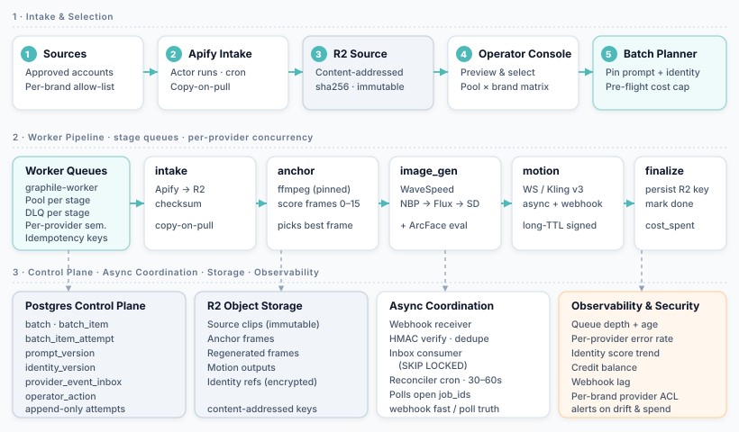
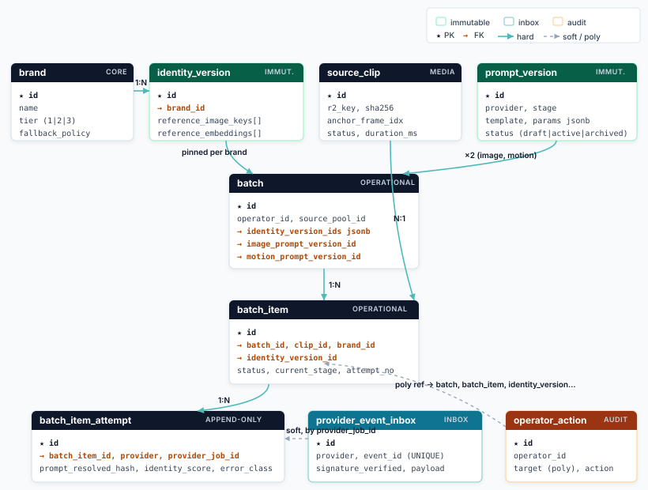
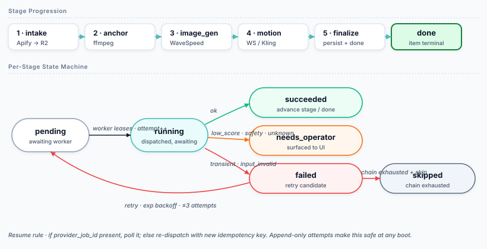

# AI Content-Production Engine — System Design

Engineer-to-engineer design notes for the in-flight brand-identity-preserving short-form video regenerator.

**Stack.** Next.js / Postgres / Drizzle · Cloudflare R2 · Apify intake · WaveSpeed image gen (Nano Banana Pro → Flux Kontext Max → Seedream v4.5) · WaveSpeed + Kling v3 Standard motion · ffmpeg first-frame extraction · worker queue + full audit trail.

> **Scope.** Concrete failure modes the live system hits first under real volume (a few hundred clips/day × multiple brands × three image providers × motion), the state machine and persisted state to make batches resumable and operator-driven, the async webhook/polling reconciliation model, prompt & identity versioning, drift detection, observability, security, and a phased rollout. Three sharp questions at the end.

A styled HTML version is included at [`AI_Content_Engine_SDD.html`](./AI_Content_Engine_SDD.html) — clone and open locally for the polished read.

---

## Contents

1. [Architecture & queue topology](#1-architecture--queue-topology)
2. [Data model](#2-data-model)
3. [Failure modes under real volume](#3-failure-modes-under-real-volume)
4. [Batch controls](#4-batch-controls)
5. [Async jobs — webhooks, polling, reconciliation](#5-async-jobs--webhooks-polling-reconciliation)
6. [Prompt versioning](#6-prompt-versioning)
7. [Brand-identity preservation](#7-brand-identity-preservation)
8. [Silent drift detection](#8-silent-drift-detection)
9. [Observability](#9-observability)
10. [Security & governance](#10-security--governance)
11. [Rollout plan](#11-rollout-plan)
12. [Three questions before owning this](#12-three-questions-before-owning-this)

---

## 1. Architecture & queue topology

Pipeline is staged, not monolithic. Each stage is its own queue with its own concurrency, retry policy, and DLQ. This matters because the stages have wildly different latency profiles and failure shapes — coupling them into one queue makes the slowest stage block the fastest, and turns every retry into a re-run of the whole chain.



**Components.**

- **Next.js app.** Operator UI + API + webhook endpoints. Stateless. Never runs the heavy work itself.
- **Workers.** Separate Node processes pulling from PG-backed queues (pgmq / graphile-worker / River-style). One worker pool per stage so concurrency is tuned independently.
- **Webhook receiver.** Thin HTTP handler whose only job is HMAC-verify the signature and write the event to `provider_event_inbox`. No business logic in the receiver. See §5.
- **Reconciler.** Cron job (every 30–60s) that scans for jobs in non-terminal states older than `max(webhook_grace, polling_floor)` and polls the provider directly. Webhook is fast-path, reconciler is the source of truth.
- **R2.** Content-addressable storage: keys are SHA256 of input hash + prompt hash + identity hash. Idempotent retries reuse outputs.

**Why split intake from selection.** The copy-to-R2 must happen at pull time, not at batch time. If the worker fetches from Apify at batch start, source decay between selection and processing becomes a hard problem — see §3.3. Treat Apify as a one-shot ingestion: pull, hash, store, never look back.

---

## 2. Data model



```text
brand
  id, name, tier (1|2|3), fallback_policy, identity_threshold, ...

identity_version            -- immutable after publish
  id, brand_id, version_no,
  reference_image_keys: text[],          -- R2 keys
  reference_embeddings: vector(512)[],   -- ArcFace face embeddings
  per_provider_conditioning: jsonb,      -- LoRA refs, IP-Adapter latents, char-ref ids
  baseline_score: float,
  published_at, published_by, retired_at

source_clip
  id, source_account, apify_run_id, fetched_at,
  r2_key_original, sha256, duration_ms, width, height, codec,
  anchor_frame_idx (nullable),           -- scored once, cached
  status (active|removed_upstream|quarantined)

prompt_version
  id, provider, stage (image|motion),
  template (jsonb),                      -- variables not yet substituted
  params (jsonb),                        -- cfg, steps, seed_policy, etc
  parent_id, status (draft|active|archived),
  created_by, created_at

batch
  id, operator_id, source_pool_id, brand_ids: int[],
  identity_version_ids: jsonb,           -- {brand_id: identity_version_id}, pinned at start
  image_prompt_version_id, motion_prompt_version_id,
  provider_chain_id,
  status (queued|running|paused|completed|aborted),
  cost_cap_cents, cost_spent_cents,
  created_at, completed_at

batch_item
  id, batch_id, clip_id, brand_id, identity_version_id,
  status (pending|running|needs_operator|succeeded|failed|skipped),
  current_stage (intake|anchor|image|motion|finalize|done),
  attempt_no, last_error_class, cost_cents,
  final_output_r2_key (nullable)

batch_item_attempt           -- one row per external call. ever.
  id, batch_item_id, stage, provider,
  provider_job_id (nullable),            -- written BEFORE awaiting
  started_at, finished_at,
  status (dispatched|running|succeeded|failed|cancelled),
  prompt_resolved_hash,                  -- hash of the SUBSTITUTED payload
  identity_hash,
  output_r2_key (nullable),
  identity_score (nullable),
  error_class, error_payload, cost_cents

provider_event_inbox         -- webhook landing zone
  id, provider, event_id (unique),       -- idempotency key from provider
  signature_verified bool, received_at,
  payload jsonb, consumed_at (nullable), consumer_lease_id

operator_action              -- audit
  id, operator_id, target_type, target_id, action, payload, created_at
```

**Key invariants.**

1. **Attempts are append-only.** Every dispatched external call writes a row before the call awaits. No row = no spend. Crash-resume reads the table to decide whether to poll or re-dispatch.
2. **Identities are immutable per version.** Editing a brand identity creates a new `identity_version`; runs pin to the version id at batch start.
3. **R2 keys are content-addressable.** Same input × same prompt × same identity → same key. Retries are free if the work already happened.
4. **Prompt comparison is on `prompt_resolved_hash`, not template id.** Templates with variables can drift while the version id stays constant.

---

## 3. Failure modes under real volume

Things that actually bite, not generic "rate limits."

### 3.1 Silent identity drift across the fallback chain

NBP, Flux Kontext Max and Seedream v4.5 do not encode identity conditioning the same way. Flux's IP-Adapter-style input lands differently than NBP's character reference; Seedream has its own identity head. When NBP 5xx's and the chain falls over, the regenerated face is visibly different — close enough to pass a glance, obviously off on a second viewing.

**Mitigation.** Tag every output with the provider that actually produced it (surface this in UI, not just audit). Make the chain **per-brand-tier**, not global — tier-1 brands stall instead of fall back, tier-2 fall back to Flux only, tier-3 use the full chain. Pre-score each provider's per-brand identity fidelity offline so the chain order is graded, not sequence-of-registration.

### 3.2 First frame is the wrong frame

ffmpeg frame-0 on a TikTok/IG re-encode often lands on a blink, mid-phoneme, motion-blurred, or under the "Original Sound" overlay. You regenerate identity onto a bad anchor, motion-condition on the bad anchor, and the first 150–300ms of the output morph-pops as the motion model stabilises.

**Mitigation.** Score frames 0–15 on a window: face visibility (detector), blur (Laplacian variance), eyes-open (landmark), occlusion, overlay-text density. Pick the best one as `anchor_frame_idx` and persist it on `source_clip`. Motion stage gets the same offset.

### 3.3 Apify source decay between selection and run

Operator curates 50 clips Monday; Wednesday's batch finds 7 source URLs 404 because the upstream was deleted or made private. Apify silently returns partial / stale results on a re-pull. Lazy re-fetch in the worker means R2 404s after image gen has already spent credits.

**Mitigation.** Copy-on-pull from Apify into R2 at intake, checksum, and **never re-fetch source upstream** for the rest of the lifecycle. Pipeline only talks to R2. Add an `active|removed_upstream` column for client-side reporting, not pipeline behaviour.

### 3.4 Signed-URL TTL < motion provider fetch latency

Kling queues — submission to actual asset-pull can be minutes when their cluster is hot. Short-TTL R2 signed URLs 4xx *after* image gen has already spent. Retry generates a fresh identity frame = a different face. The audit looks like "transient failure" when it's a token expiry problem.

**Mitigation.** Long-TTL presigned URLs (12–24h) for provider-facing handoffs, or proxy through an internal short-lived presigner the provider can refresh. Image-gen output is content-addressable on R2 so retries reuse the same frame.

### 3.5 Credit exhaustion as a retry storm

Provider 402/insufficient looks identical to a transient 5xx to a naive retry policy. Workers hot-retry, queue saturates, and nothing useful happens until a human notices the spend has stopped going up.

**Mitigation.** Pre-flight credit estimate per batch with hard cap. 402 is a **circuit-breaker**, not a retryable error — pause the whole batch, alert, resume on top-up. Per-provider credit balance is polled hourly and surfaced as a metric (§9).

### 3.6 At-least-once delivery × non-idempotent provider calls = double spend

Worker crashes after dispatching a generation but before persisting `provider_job_id`. Job is redelivered, second call goes out, two outputs are produced, two charges land. At 200 clips × 3-provider fallback this is easily 4–5% of spend.

**Mitigation.** Idempotency key on every external call: `sha256(clip_id, attempt_no, provider, prompt_resolved_hash, identity_hash)`. Write `batch_item_attempt` row with `status=dispatched` *before* awaiting the call. On resume, look up `provider_job_id` and poll instead of re-dispatching. If the provider supports idempotency tokens, send the same key.

### 3.7 Brand identity bundle edited in place

Operator "tweaks" the brand reference images to fix a bad batch. All historical runs are now incomparable — the identity they claim to use isn't what's in the registry now. Drift detection becomes meaningless.

**Mitigation.** Identity is versioned and immutable per version. Runs pin `identity_version_id`, never `brand_id`. New references = new version. Old versions retired, not edited.

### 3.8 Motion provider content-safety rejections that look like generic failures

Kling's safety filter is twitchy on mouths/eyes and produces ambiguous error codes. Without a typed error taxonomy, the operator sees "failed" with no actionable next step.

**Mitigation.** Normalise provider errors into a typed taxonomy — `{transient, credits, safety, input_invalid, identity_low_score, unknown}` — drive the retry/surface decision off the type, not the HTTP code (§4).

### 3.9 Webhook delivery is unreliable and re-orderable

Providers retry webhooks on 5xx, give up after N tries, and don't guarantee order. A `job.succeeded` can arrive before `job.running`; a duplicate `job.succeeded` can arrive an hour later. If the receiver crashes between accepting the HTTP request and persisting the event, the event is lost.

**Mitigation.** Webhook receiver writes to `provider_event_inbox` in a single transaction; HTTP 200 is only returned after commit. State machine only advances forward — a late "running" cannot undo a "succeeded". Idempotent on provider's `event_id`. Reconciler covers the case where the webhook never arrives. See §5.

### 3.10 ffmpeg version skew on source codecs

An ffmpeg upgrade in the worker image silently breaks frame extraction on a subset of re-encodes (returns a green frame, wrong PTS, or off-by-one frame). Identity score plummets across all affected clips but the operator sees no error.

**Mitigation.** Pin ffmpeg version; golden-frame test in CI on a fixed library of weird source codecs. Alert on pixel-entropy outliers (a green frame has a distribution signature). Worker image SHA in every `batch_item_attempt`.

### 3.11 R2 multipart and concurrent-write quirks

Two workers writing the same content-addressable key concurrently is fine; two workers writing the same *metadata* object (e.g. a manifest) is not. R2 is eventually consistent on list operations, strongly consistent on get-after-put for the same key.

**Mitigation.** Never use list-after-write as a synchronisation point. Manifests are in Postgres, not R2. Object keys, not paths, are the source of truth.

---

## 4. Batch controls



### 4.1 Stage state machine

One state machine per `batch_item`, executed by the worker for whichever stage matches `current_stage`. On `succeeded`, `current_stage` advances; if last stage, the item is `done`. The same machine runs at every stage.

### 4.2 Retry / skip / surface policy by error class

| Class | Action | Why |
|---|---|---|
| `transient` | Exp backoff, ≤3 in-stage; then next provider in chain. | Network/5xx — cost is just retry time. |
| `credits` (402) | Circuit-break whole batch. Pause. Alert. | Retrying without credits is pure noise. |
| `safety` | Next provider *iff* brand policy permits crossover; else `needs_operator`. | Same prompt + different provider sometimes passes; tier-1 brands stall. |
| `input_invalid` | One retry with alternate `anchor_frame_idx`; else `needs_operator`. | Bad frame is the common cause; one cheap retry pays off. |
| `identity_low_score` | Never auto-retry. Surface with bad output. | Auto-retry burns credits; humans catch identity better than thresholds. |
| `unknown` | Surface immediately. | Blind retry on unknown is how you burn $500 overnight. |

### 4.3 Resumability

Worker boot procedure (idempotent, safe to run any time):

1. Find `batch_item`s with `status=running`. For each, load most recent `batch_item_attempt` with `status=dispatched`.
2. If `provider_job_id IS NOT NULL` → poll provider. If terminal, persist result; advance stage. If still running, leave it for the reconciler. If failed, classify and re-enter §4.2.
3. If `provider_job_id IS NULL` → crashed pre-dispatch. Bump `attempt_no`, re-dispatch with new idempotency key. No double-spend because nothing was charged.

This is the only resume path. There is no "restart the batch from scratch" button — it would re-spend everything.

### 4.4 What the operator sees

- **Live counts** per stage per status, refreshed via SSE or short-poll.
- **Per-clip card**: source thumbnail → regenerated frame → motion preview (each appears as the stage completes), with a provider badge.
- **Running cost vs cap**, and ETA from rolling per-stage latency.
- **Surface queue**: a dedicated panel of items in `needs_operator` — low identity score, content rejection, ambiguous failure. Operator picks: approve-as-is / regenerate (new seed) / regenerate (alt anchor frame) / skip.
- **Per-brand sub-progress**, because operators usually care about one brand at a time even when the batch spans many.
- **Pause / resume** at batch level. Pause halts dispatch on uncompleted items; in-flight attempts continue (you cannot un-spend).

### 4.5 Decision rule

**Retry** only for `transient` and the one alternate-frame attempt on `input_invalid`. **Skip** is automatic only when the chain is exhausted *and* brand policy is `skip_rather_than_degrade`. **Surface** is the default for anything ambiguous. Ten seconds of operator attention is cheaper than $0.40 of credits spent on a guess.

---

## 5. Async jobs — webhooks, polling, reconciliation

Provider APIs are asynchronous and unreliable. Webhook-only is brittle; polling-only is slow and wasteful; you need both.

### 5.1 Webhook path (fast path)

1. Provider POSTs to `/webhook/{provider}`.
2. Receiver verifies HMAC signature against the versioned secret. Reject unsigned/invalid.
3. Receiver INSERTs into `provider_event_inbox` with the provider's `event_id` as a unique key. Duplicates are no-ops (`ON CONFLICT DO NOTHING`). Commit, then 200.
4. A small worker pool drains the inbox, advances state machines, writes outputs to R2 if needed.

**Why the inbox.** Decouples HTTP availability from business logic. Receiver only has to be fast and idempotent. Even if the consumer is down for an hour, no events are lost. Replay is just re-running the consumer.

### 5.2 Polling path (reconciliation)

Cron every 30–60s:

```sql
SELECT * FROM batch_item_attempt
WHERE status IN ('dispatched','running')
  AND finished_at IS NULL
  AND started_at < now() - interval '90 seconds';
```

For each, poll the provider directly by `provider_job_id`. If terminal, advance. If still running, update `updated_at` and move on. This catches:

- Webhook never delivered (provider gave up, our endpoint had an outage).
- Webhook silently lost between receiver and consumer (rare with the inbox, but possible during DB outages).
- Jobs the provider considers complete but never sent a final webhook for.

### 5.3 Ordering & idempotency

- State machine only advances forward. A `running` event after `succeeded` is dropped.
- Output writes to R2 use content-addressable keys; a duplicate `succeeded` overwriting the same bytes is harmless.
- The consumer takes a `FOR UPDATE SKIP LOCKED` lease on the inbox row so two consumers can't process the same event concurrently.

### 5.4 Variable latency & concurrency

Per-provider concurrent-job limits live in `provider_chain_config`. The image-gen queue worker takes a token from a Postgres-backed semaphore (or a Redis one if available) before dispatching, releases on terminal. This is how you respect "Kling allows N concurrent per account" without spreading config knowledge across every worker.

---

## 6. Prompt versioning

- Prompts are rows, not strings in code. `prompt_version(id, provider, stage, template, params, parent_id, status)`.
- Every run pins `(image_prompt_version_id, motion_prompt_version_id)`. Never "current."
- **Store the resolved payload** sent to the provider as `prompt_resolved_hash` on each attempt. Templates with variable substitution drift even while the version id is constant — without the resolved hash, two runs can claim the same prompt but be different in practice.
- "Active" is a pointer per `(provider, stage)`; rollback is a pointer flip. Historical runs keep their pin and stay comparable.
- A/B: two `active` variants per stage with a traffic split. `batch_item_attempt` carries which arm. Comparison is just SQL on identity scores grouped by prompt version.
- Promote/demote is an `operator_action` audit row. Who flipped the active prompt and when is always recoverable.

---

## 7. Brand-identity preservation

Identity is a versioned bundle, not a folder:

```text
identity_version
  id, brand_id, version_no,
  reference_image_keys: text[],              -- 3–10 R2 keys
  reference_embeddings: vector(512)[],       -- ArcFace, computed once at publish
  per_provider_conditioning: jsonb,          -- LoRA refs, IP-Adapter latents, char-ref ids
  baseline_score: float,                     -- mean cosine on a holdout
  published_at, retired_at
```

**Per-output eval.**

1. Compute face embedding on the regenerated first frame (single ArcFace pass, cheap).
2. Cosine similarity vs the identity's reference embeddings (mean of top-k matches).
3. Persist as `batch_item_attempt.identity_score`.
4. Below brand-specific threshold → classify as `identity_low_score`, surface.

Face embeddings are cheap, robust to lighting/pose, provider-agnostic, and the threshold is the only knob (set per brand because tolerance varies — polished talent vs UGC creator).

---

## 8. Silent drift detection

Six signals, in rough order of usefulness:

1. **Identity score rolling mean per (brand, provider, prompt_version)**. Flag on > N-sigma drop over 7 days. Slice by provider — drift is usually one provider, not all.
2. **Operator approval rate** = succeeded with no regen / total surfaced. Best *leading* indicator. When this drops, something has changed even if scores haven't.
3. **Distribution shift on identity score** — weekly KS test on the score distribution vs the prior 4 weeks. Catches "the mean is fine but the tail got worse."
4. **Motion start-frame fidelity** = SSIM between regenerated anchor frame and motion-output frame 0. Widening means the motion provider has started ignoring conditioning more (their model update, not yours).
5. **Cost per approved output**. Climbs before quality breaks visibly because retries silently rise first.
6. **Canary clips** — ~10 fixed source clips × identity versions × frozen prompt versions, processed nightly, scored against a baseline. Cleanest signal because everything else is controlled; if canary moves, only the provider has changed.

Weekly dashboard, per-brand and per-provider. No human watches outputs; humans watch deltas.

---

## 9. Observability

**Metrics.**

- Queue depth and oldest-pending-age per stage.
- p50/p95 latency per (stage, provider).
- Error rate per (stage, provider, error_class).
- Identity score histogram per (brand, provider, prompt_version).
- Cost per approved output, per brand.
- Per-provider credit balance (polled, alert on threshold).
- Webhook inbox lag (`received_at` → `consumed_at`).
- Reconciler hit rate (% of jobs resolved by polling vs webhook). Climbing means webhooks are degrading.

**Traces.** Span per stage, propagated through dispatch. Tags: `batch_id, batch_item_id, attempt_id, provider, provider_job_id, prompt_version_id, identity_version_id`. Lets you walk from an operator action to a final output through every external call.

**Logs.** Structured JSON, always carrying `{batch_id, batch_item_id, attempt_id}`. Provider request/response payloads logged at debug, redacted of secrets, sampled at info.

**Dashboards.**

- *Ops view.* Queue depths, error rates by class, credit balances, webhook lag.
- *Quality view.* Identity score trend, approval rate, KS-test status, canary results.
- *Per-batch view.* Operator's live view (§4.4) is also this dashboard.

**Alerts.**

- Credit balance < N hours of forecast burn.
- Error rate by class > threshold for 10 min.
- Identity score 7-day mean drop > N sigma.
- Reconciler resolving > 30% of jobs (webhook path degraded).
- Queue depth growing 15+ min on any stage.

---

## 10. Security & governance

- **Identity reference data is PII / likeness** in most jurisdictions. Encrypted at rest in R2, scoped credentials per environment, signed-URL-only access. No public buckets, ever.
- **Outbound data inventory.** Every byte sent to a third-party provider is logged (which provider, which call, which clip, which identity). Per-brand list of "providers this identity is allowed to be sent to" — supports brands whose contracts forbid certain vendors.
- **Secrets.** Per-provider API keys in a secrets manager (Doppler / 1Password / cloud-native), env-scoped, rotated. No `.env` files in repo. Webhook signing secrets versioned so rotation is non-disruptive.
- **RBAC.** Operators run batches and approve outputs. Only admins publish/retire identity versions or promote prompt versions. Every state-changing action writes to `operator_action`.
- **Data retention.** Identity versions have a configurable TTL; references are hard-deleted from R2 after retirement + grace period. Embeddings can be retained longer than reference images if the rights model requires it.
- **Webhook security.** HMAC verify with versioned secret, replay protection via `event_id` uniqueness + a `received_at` window, IP allow-list where the provider publishes one.
- **Egress.** Worker outbound network constrained to the provider domains. Catches a compromised dependency exfiltrating identity images.

---

## 11. Rollout plan

1. **Phase 0 — feature flag everything.** New batch flow lives behind a flag; current flow stays default. Schema migrations are additive and backward-compatible.
2. **Phase 1 — shadow mode.** New batches run end-to-end but outputs are not published. Compare identity scores and operator-approval-equivalents against the manual baseline on real source pools. Tune thresholds.
3. **Phase 2 — tier-3 brands at 10%.** Lowest-stakes brands route real batches through the new system. Quality + cost SLOs gate progression.
4. **Phase 3 — tier-3 100%, tier-2 progressively.** Per-brand opt-in. Watch drift dashboards before broadening.
5. **Phase 4 — tier-1.** Tier-1 stays on the "no fallback" policy (§3.1). Opt-in by brand, with a dry-run requirement.

Rollback: the flag flips back to the legacy flow. All in-flight batches persist in Postgres and can resume (or be aborted by the operator) on either side of the flag. No destructive migrations.

---

## 12. Three questions before owning this

1. **What's the operator SLA — first-usable-output latency, and full-batch latency?** This decides whether the queue parallelises aggressively (high concurrent credit burn, hot fallbacks, more identity-score variance) or runs a slower, cheaper serial chain with backpressure. The architecture branches hard on the answer.

2. **What's the legal / rights model for brand identity reference data — user-supplied photos, paid creator likenesses with usage windows, or AI-generated baselines?** This dictates whether identity versions are retained indefinitely or auto-expire, whether cross-provider conditioning (uploading reference images / LoRA weights to a third-party motion provider) is permitted, and whether per-brand "no fallback" is a hard requirement or a tuning choice.

3. **When the primary image provider degrades, is "delayed but on-brand" or "on-time but slightly off-brand" the worse failure?** Same question reframed: is this a throughput business or a per-output-quality business? The fallback chain policy, the surface-vs-skip default, and how aggressively we ship tier-1 brands onto the new flow all flip on this.
